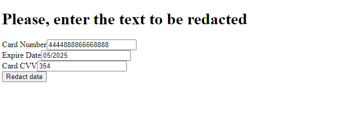
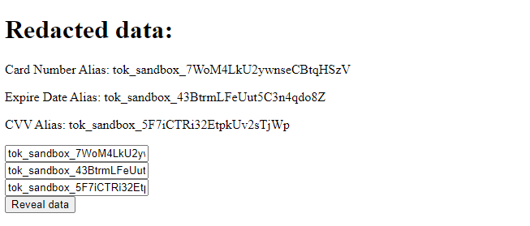
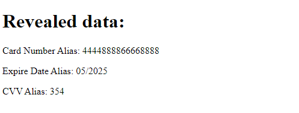

# Description

1. To redact sensitive data and press 'Redact data' button:

    
1. To reveal data copy you data alias into form field and press 'Reveal data' button:

    
1. Now you can see your original data: 

    
    

# Usage
1. Clone this repo

        https://github.com/andrewbudzan/vgs-tt
1. Install requirements

        pip install requirements.txt
1. Run `simple_app.py`

        py simple_app.py 